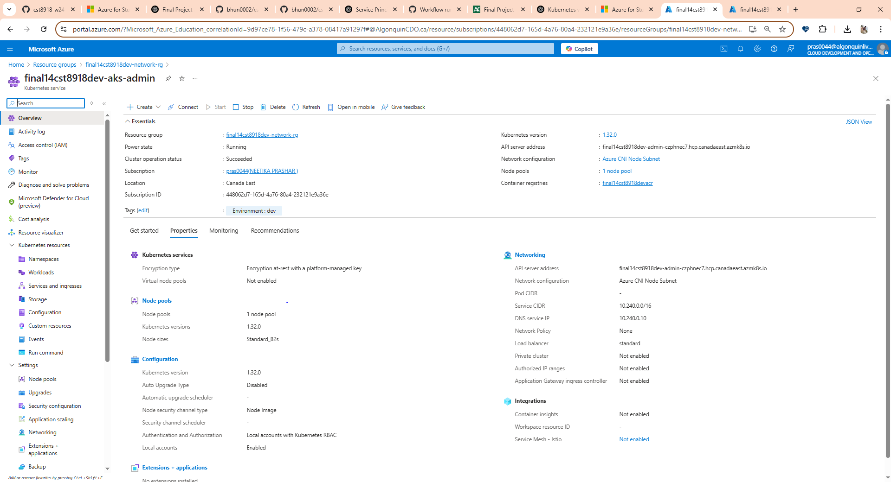
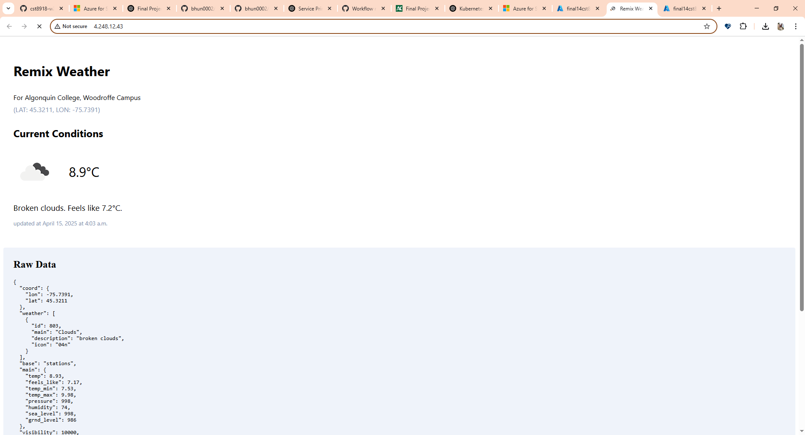
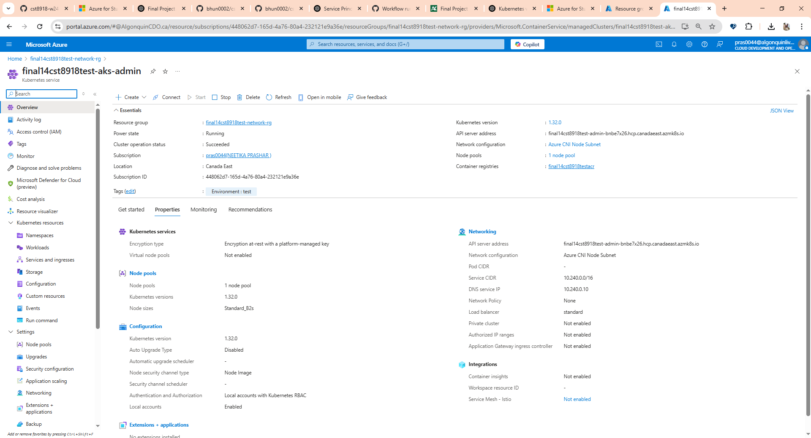
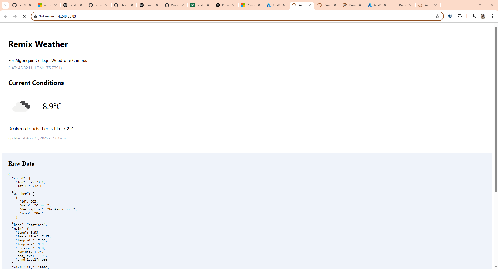
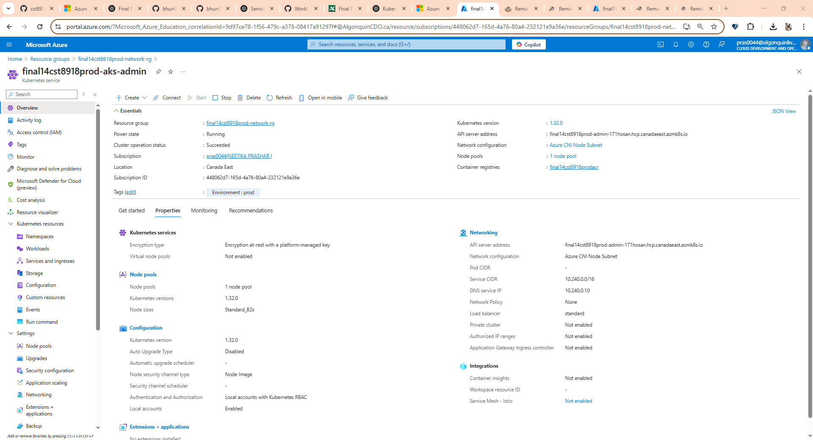
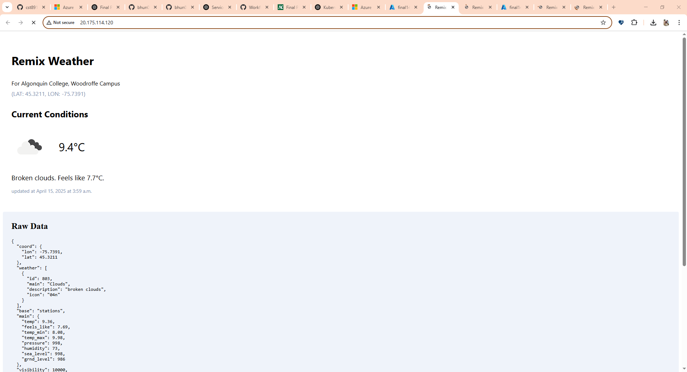
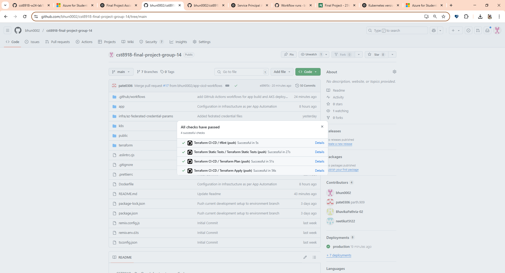
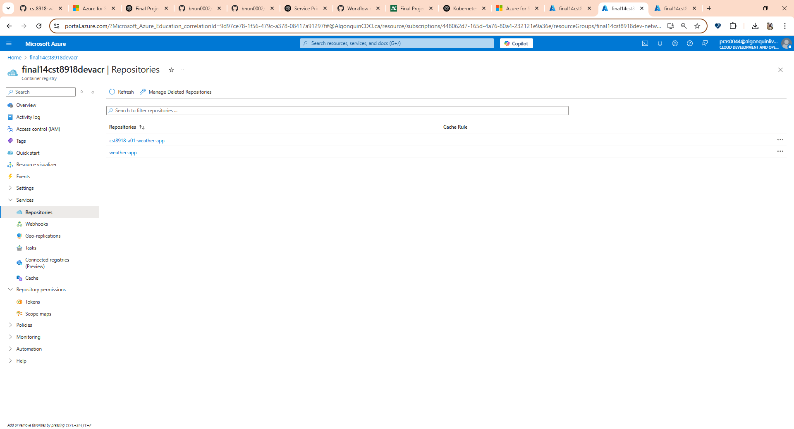
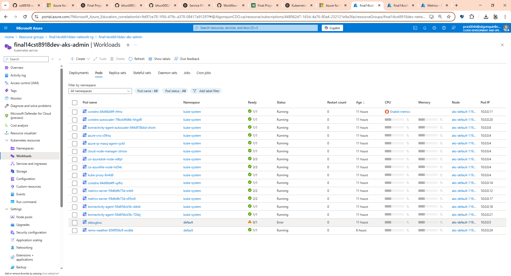
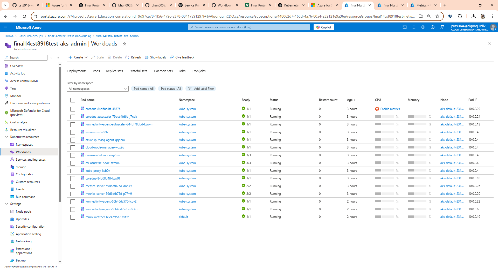

# CST8918 - DevOps: Infrastructure as Code Final Project

## Project Title: Remix Weather App Deployment with Terraform and GitHub Actions

**Professor**: Robert McKenney  
**Course**: CST8918 - DevOps: Infrastructure as Code  
**Group**: Group 14  
**Team Members**:
- [Deval Bhungaliya](https://github.com/bhun0002)
- [Parth Patel](https://github.com/pate0306)
- [Bhavika Pathria](https://github.com/BhavikaPathria-02)
- [Neetika Prashar](https://github.com/neetika15122)

---

## Project Overview
This project demonstrates the use of Infrastructure as Code (IaC) using Terraform to provision and manage Azure cloud resources for deploying the Remix Weather Application. The application is deployed across multiple environments (dev, test, and prod) using AKS clusters, Azure Redis Cache, and Azure Container Registry (ACR). The infrastructure and application deployment are fully automated using GitHub Actions and follow CI/CD best practices with security, modularity, and scalability.

---

## Project Architecture
- **Azure Blob Storage**: Used as the Terraform backend for storing state files securely.
- **Azure Virtual Network (VNet)**: A shared VNet with 4 subnets for dev, test, prod, and admin environments, using address space 10.0.0.0/14.
- **Azure Kubernetes Service (AKS)**:
  - **Test Environment**: 1-node cluster with B2s VM and Kubernetes v1.32
  - **Prod Environment**: Cluster with autoscaling (1–3 nodes), B2s VMs, Kubernetes v1.32
- **Azure Container Registry (ACR)**: Stores the Docker image for the Remix Weather Application.
- **Azure Redis Cache**: Used in both test and prod environments to cache weather data.
- **Kubernetes**: Hosts the weather app via a `Deployment` and `Service` in each environment.

---

## Terraform Modules Structure
- **backend/**: Sets up Azure Blob Storage backend for Terraform state management
- **network/**: Configures VNet and subnets with CIDR blocks
- **aks/**: Provisions AKS clusters with required specs for test and prod
- **acr/**: Creates Azure Container Registry
- **redis/**: Creates Redis Cache for test and prod environments
- **app-resources/**: Deploys Kubernetes manifests for the weather app

---

## GitHub Actions CI/CD Workflows
### Static Infrastructure Tests (`infra-static_tests.yml`)
- Runs on **push** to any branch
- Includes:
  - `terraform fmt`
  - `terraform validate`
  - `tfsec` for security linting

### Pull Request Infrastructure Validation (`infra-ci-cd.yml`)
- Runs on **pull_request** to `main`
- Includes:
  - `tflint` for code quality
  - `terraform plan` for change previews

### Production Infrastructure Deployment (`infra-ci-cd.yml`)
- Runs on **push** to `main`
- Applies infrastructure changes using `terraform apply`

### Drift Detection (`infra-drift-detection.yml`)
- Detects infrastructure drift
- Uses `terraform plan` against live state

### Application Build and Deploy
- **Docker Build and Push**: Runs on pull request with app code changes; image is tagged with commit SHA and pushed to ACR
- **Deploy to Test (PR)**: Deploys weather app to test AKS environment when app code changes in a pull request
- **Deploy to Prod (Merge)**: Deploys weather app to prod AKS when PR is merged to `main`

---

## Branch Protection Rules
- Pull request reviews required before merging
- Status checks required (static tests, plan, etc.)
- Require branches to be up to date before merging
- Disallow self-approval

---

## Application Deployment
- App code and infra are versioned and deployed together from the same repository
- Manual deploys avoided; all environments use automated GitHub Actions

---

## Special Instructions to Run the Project
1. Clone the repository
2. Authenticate with Azure using the `az login` CLI
3. Run `terraform init` and `terraform apply` in the desired environment folder
4. Use `kubectl get pods` to verify app deployment

---

## Screenshots

### ☁️ AKS Clusters in Azure Portal

#### 🔧 Development Environment (dev)
- Resource Group, AKS cluster details, and networking setup

  

#### 🧪 Test Environment (test)
- Cluster information and node details for test AKS setup

  

#### 🚀 Production Environment (prod)
- Autoscaling and production-ready configuration

  

---

### ✅ GitHub Actions Workflows
- Successful runs of static tests, Terraform plan/apply, Docker build, and app deployments

---

### 📦 Azure Redis & ACR
- Redis Cache and Azure Container Registry resources in the portal

---

### 🚀 Running Pods and Services

#### 🔧 Dev Environment

#### 🧪 Test Environment

#### 🚀 Prod Environment

---

## Submission Info
- GitHub Repository: [[GitHub Repo Link Here](https://github.com/bhun0002/cst8918-final-project-group-14)]
- Collaborator Added: `rlmckenney`
- All workflows and features implemented as per the final project specifications.
